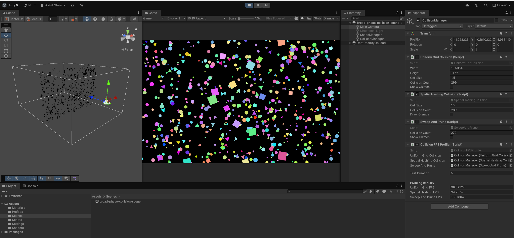

# 🧩 Broad-Phase Collision Detection

This project explores **broad-phase discrete collision detection** by implementing and comparing three commonly used algorithms in computer graphics and game engines.

#### ⚙️ Algorithms
- **Uniform Grid** – Partitions space into fixed-size cells to reduce collision checks to nearby objects.
- **Spatial Hashing** – Uses a hash-based grid to dynamically map objects to spatial buckets.
- **Sweep and Prune (SAP)** – Detects potential collisions by sorting object intervals along an axis.

#### 🧠 Design Notes
- All algorithms are implemented in **2D**, but the same principles can be **extended to 3D**.
- The project focuses on **broad-phase filtering**, not narrow-phase collision resolution.
- Shapes are instantiated using **GPU instancing** to efficiently handle a large number of objects.

#### 📊 Comparison & Profiling
- The algorithms are compared using a simple **FPS-based profiler**.
- Collision counts are sampled over a short time window to observe relative performance.
- This comparison is **not a rigorous benchmark**, but a high-level tool for understanding algorithm behavior.

---
## 📸 Project Screenshot from Unity

#### 🔷 Broad-Phase Collision Scene (2D)

    

---

## 🎥 Demo Video

A short walkthrough showcasing the Uniform Grid, Spatial Hashing, and Sweep and Prune broad-phase collision detection algorithms can be found [here](https://www.youtube.com/your-video-link).
